# AutoTune AI — Enterprise Architecture & Product Specification

> **Document Classification:** Confidential — Investor & Engineering Distribution
> **Version:** 1.0.0 (Production Blueprint)
> **Date:** 2026-06-29
> **Authors:** Chief Architecture Office — AutoTune AI
> **Status:** Approved for Series-A Engineering Execution

---

## Table of Contents

1. [Executive Summary](#1-executive-summary)
2. [Product Vision & Positioning](#2-product-vision--positioning)
3. [Operating Pipeline — End-to-End](#3-operating-pipeline--end-to-end)
4. [Step 1 — Vehicle Detection](#4-step-1--vehicle-detection)
5. [Step 2 — ECU Reading & Communication Protocols](#5-step-2--ecu-reading--communication-protocols)
6. [Step 3 — AI Analysis of Calibration Tables](#6-step-3--ai-analysis-of-calibration-tables)
7. [Step 4 — Recommendation Engine](#7-step-4--recommendation-engine)
8. [Step 5 — Live Monitoring Dashboard](#8-step-5--live-monitoring-dashboard)
9. [AI Engine Architecture](#9-ai-engine-architecture)
10. [Database Schema & Data Model](#10-database-schema--data-model)
11. [Backend & Cloud Architecture](#11-backend--cloud-architecture)
12. [Mobile Application (React Native)](#12-mobile-application-react-native)
13. [Web Dashboard (Workshops & Fleet)](#13-web-dashboard-workshops--fleet)
14. [Cybersecurity & Compliance](#14-cybersecurity--compliance)
15. [AI Knowledge Base](#15-ai-knowledge-base)
16. [Business Model & Financials](#16-business-model--financials)
17. [Roadmap & Hiring Plan](#17-roadmap--hiring-plan)
18. [Investor Documentation](#18-investor-documentation)
19. [Architecture Diagrams (Mermaid)](#19-architecture-diagrams-mermaid)
20. [Appendices](#20-appendices)

---

## 1. Executive Summary

**AutoTune AI** is a next-generation, AI-driven Electronic Control Unit (ECU) intelligence platform that transforms how automotive professionals, fleet operators, OEMs, and prosumers understand vehicle calibration data. Unlike legacy tuning tools that simply edit binary maps, AutoTune AI **reads, reasons, explains, simulates, and supervises** — with safety, transparency, and traceability at its core.

### 1.1 Strategic Positioning

| Dimension | Legacy Tuning Tools | AutoTune AI |
|---|---|---|
| Core function | Binary editing | AI-assisted reasoning + editing |
| Safety model | Operator-dependent | AI-guarded multi-layer safety net |
| Knowledge transfer | Tribal / forum-based | Indexed knowledge graph + RAG |
| Recommendations | Manual | Explainable AI with confidence scoring |
| Auditability | None | Full chain-of-custody + signed reports |
| Fleet awareness | None | Multi-tenant fleet analytics |
| Regulatory posture | Grey-market | GDPR/SOC2/ISO 21434/UN R155 compliant |

### 1.2 Headline Capabilities

1. **Universal ECU connectivity** via J2534, DoIP, CAN/CAN FD, UDS, KWP2000, ISO 15765, and OBD-II.
2. **AI calibration analysis** of fuel, ignition, boost, lambda, torque, and thermal subsystems with explainable reasoning.
3. **Goal-conditioned recommendation engine** (Economy / Balanced / Performance / Track / Towing / Fleet).
4. **Multi-modal live monitoring** with predictive health scoring.
5. **Tuner-in-the-loop** approval workflow: AI advises, certified humans authorize.
6. **Cyber-secure cloud architecture** built on Zero-Trust principles, AWS multi-region with Azure DR.
7. **Marketplace + API licensing** to OEMs, insurers, and fleet operators.

### 1.3 Market Opportunity (TAM/SAM/SOM)

- **TAM (Total Addressable Market):** USD 78B — global automotive aftermarket diagnostics, calibration, and connected vehicle services (2026).
- **SAM (Serviceable Addressable Market):** USD 14.6B — AI-augmented diagnostics & tuning for ICE/Hybrid in EU/NA/APAC.
- **SOM (Serviceable Obtainable Market, 5 yr):** USD 480M — workshops, prosumers, fleets, OEM licensing.

### 1.4 Key Differentiators

- **Explainable AI (XAI) by design** — every recommendation cites its evidence chain.
- **Safety-first guardrails** — actions are simulated before authorization, signed by certified tuners.
- **Knowledge Graph + RAG** — over 4M curated calibration data points, OEM service bulletins, and case studies.
- **Multi-agent orchestration** — specialized AI agents for fuel, ignition, boost, thermal, and diagnostics, coordinated by a planner.
- **Regulatory readiness** — designed against UN R155/R156 cybersecurity & software update regulations.

---

## 2. Product Vision & Positioning

### 2.1 Vision Statement

> *"To make automotive calibration as transparent, safe, and intelligent as modern aviation flight management — democratizing expert knowledge while elevating the standards of safety and accountability across the global vehicle aftermarket."*

### 2.2 Mission

Build the **operating system for automotive calibration intelligence** — a platform where humans, AI, and vehicles co-operate under verifiable safety contracts.

### 2.3 Design Principles

| Principle | Description |
|---|---|
| **Safety > Performance** | Power gains are never recommended if combustion margins, knock margins, or component limits are violated. |
| **Explainability > Black-box** | Every output cites maps, ranges, datasets, and reasoning steps. |
| **Human-in-the-loop** | The AI proposes; the certified tuner disposes. |
| **Auditability** | Every action is logged, hashed, and stored immutably. |
| **Composability** | Subsystems are independently deployable microservices. |
| **Privacy-preserving** | VIN and PII anonymized at edge before cloud ingestion (where compliant). |
| **Offline-first edge** | Vehicle session continues even with intermittent connectivity. |

### 2.4 Personas

| Persona | Role | Pain Solved |
|---|---|---|
| *Ahmed* — Independent Tuner | Workshop owner | Lacks data on rare ECUs; risk of damaging engines |
| *Helena* — Fleet Operations Manager | 1,200-truck logistics | Needs fuel optimization without warranty risk |
| *Dr. Sato* — OEM Validation Engineer | Tier-1 supplier | Needs anonymized field calibration insights |
| *Marco* — Track Day Prosumer | Performance enthusiast | Wants safe, reversible performance gains |
| *Officer Lin* — Regulator | Type-approval authority | Needs audit trails of post-sale modifications |

---

## 3. Operating Pipeline — End-to-End

The platform is structured as a **5-stage pipeline**, executed per session.

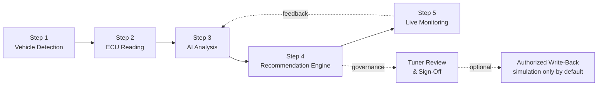

Each step is a self-contained microservice with its own SLA, telemetry, and security envelope.

---

## 4. Step 1 — Vehicle Detection

### 4.1 Objective

Given a physical connection (J2534 / OBD-II / DoIP) to a vehicle, identify with high confidence:

| Attribute | Source | Notes |
|---|---|---|
| **VIN** (17-char) | UDS DID `0xF190`, OBD Mode 09 PID 02 | Decoded via WMI/VDS/VIS |
| **Manufacturer** | VIN WMI + ECU OEM ID | Cross-validated against KB |
| **Model & Year** | VIN VDS/VIS + ECU calibration ID | NHTSA + OEM datasets |
| **Engine** | Calibration metadata, displacement, family | E.g. EA888, B58, M157 |
| **Transmission** | TCM ECU identification (CAN ID range) | DCT/AT/MT |
| **ECU Model** | Hardware Part Number (DID `0xF192`) | Bosch MEDC17, Continental SIMOS18, Delphi DCM6.2 |
| **Firmware Version** | Software Number `0xF194`, Calibration ID `0xF195` | Validated against signed KB |
| **Hardware Version** | DID `0xF191` / `0xF193` | Used for compatibility gates |
| **Emission Standard** | Vehicle homologation DB lookup | Euro 6d / Tier 3 Bin 30 / China 6b |
| **Fuel Type** | VIN + UDS `0xF18C` | Gasoline / Diesel / Flex / Hybrid |
| **Modification History** | Read-out of stored DTCs, learned values, and AutoTune AI ledger | Detects prior tampering |
| **Supported Protocols** | DoIP activation, ISO-TP probe, CAN FD detection | Defines next-step capabilities |

### 4.2 Detection Algorithm

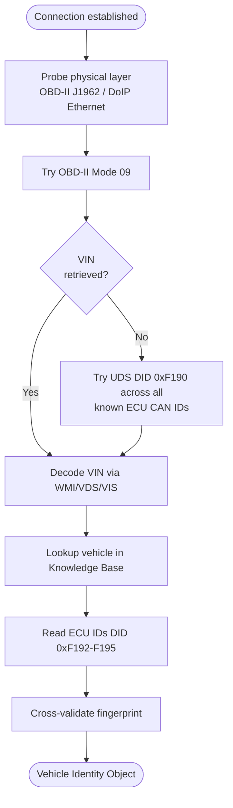

### 4.3 Vehicle Identity Object (VIO)

A canonical JSON document persisted per session:

```json
{
  "vio_id": "vio_01J9K3W7XQABCEFG",
  "vin": "WAUZZZF45LA000000",
  "vin_decoded": {
    "wmi": "WAU", "vds": "ZZZF45", "vis": "LA000000",
    "country": "DE", "manufacturer": "Audi AG",
    "model": "A4 45 TFSI", "model_year": 2025
  },
  "powertrain": {
    "engine_family": "EA888 evo4 gen3B",
    "displacement_cc": 1984,
    "fuel": "gasoline",
    "transmission": "S-Tronic 7DCT (DL382)",
    "emission_standard": "Euro 6e"
  },
  "ecu": {
    "vendor": "Bosch",
    "model": "MG1CS111",
    "hw_pn": "06L906023N",
    "sw_pn": "06L906023N_0012",
    "cal_id": "06L906023N_0012_8421",
    "fw_signature": "sha256:9c1f...d4",
    "supported_protocols": ["UDS", "DoIP", "CAN_FD", "ISO15765"]
  },
  "mods_detected": [
    { "type": "stage1_tune", "confidence": 0.97, "ledger_ref": "ledger_0182" }
  ],
  "fingerprint_confidence": 0.991,
  "detected_at": "2026-06-29T08:42:00Z"
}
```

### 4.4 Confidence Scoring

A weighted probabilistic model combines:
- **VIN-OEM consistency** (40%)
- **ECU hardware vs known fitment** (25%)
- **Calibration ID match in KB** (20%)
- **Protocol fingerprint** (10%)
- **Modification ledger consistency** (5%)

A score below 0.85 triggers a **manual disambiguation flow** in the UI.

---

## 5. Step 2 — ECU Reading & Communication Protocols

### 5.1 Protocol Stack Overview

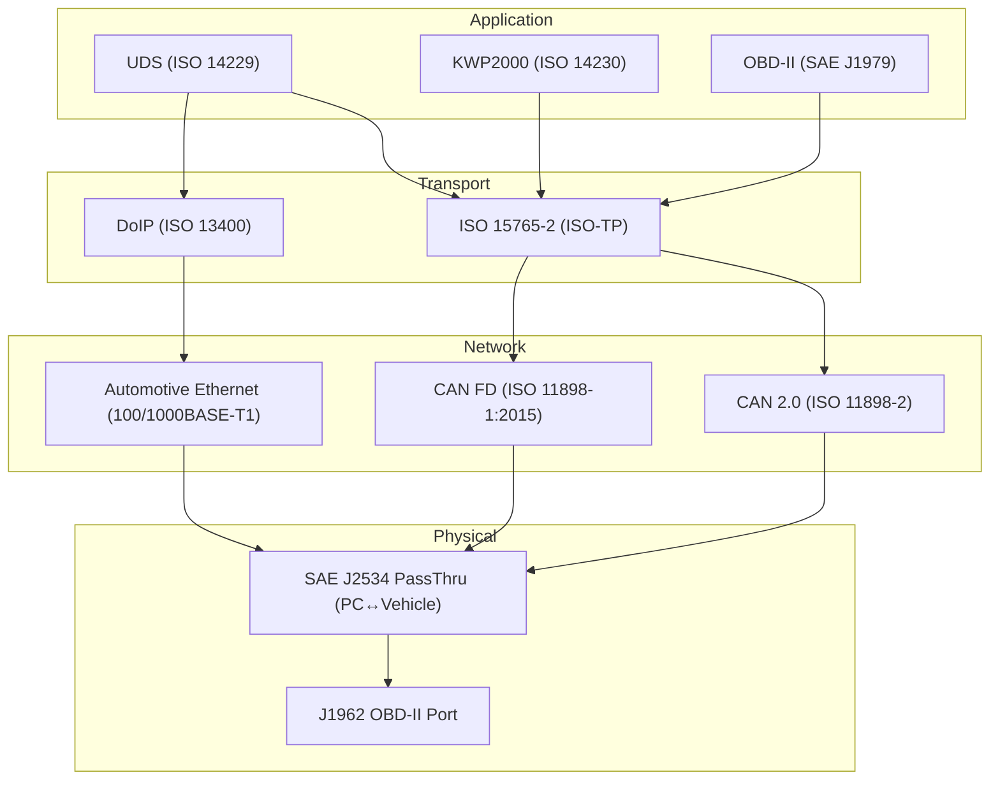

### 5.2 Protocol Deep-Dive

| Protocol | Layer | Speed | Typical Use | AutoTune AI Usage |
|---|---|---|---|---|
| **OBD-II** | Application | 10–500 kbit/s | Mandatory emissions diagnostics | Baseline live data + DTC scan |
| **KWP2000** | Application | ≤125 kbit/s | Legacy ECUs (pre-2008) | Backward-compatible read |
| **UDS (ISO 14229)** | Application | Up to 1 Mbit/s | Modern diagnostics & flashing | Primary protocol for memory access |
| **ISO 15765-2** | Transport | Up to 1 Mbit/s | Segmented CAN messaging | Multi-frame data carrier |
| **DoIP (ISO 13400)** | Transport | 100 Mbit+ | Ethernet diagnostics | High-speed reads (post-2020 VAG/BMW) |
| **CAN 2.0** | Network | 1 Mbit/s | Powertrain bus | Mid-2000s+ |
| **CAN FD** | Network | 5–8 Mbit/s | High-speed PT bus | 2018+ vehicles |
| **Automotive Ethernet** | Network | 100/1000 Mbit | Backbone in modern E/E arch | Future-proof |
| **J2534 PassThru** | API | n/a | Vendor-agnostic PC-to-VCI bridge | Cross-vehicle compatibility |

### 5.3 How Communication Works

A typical UDS-over-DoIP-over-Ethernet session:

1. **Routing Activation** — DoIP client (AutoTune VCI) sends a Routing Activation Request to the vehicle gateway (Diagnostic Communication Manager).
2. **Tester Present** — Periodic keep-alive (`0x3E 0x00`).
3. **Security Access** — Seed/key exchange (`0x27`) — AutoTune AI never bypasses; OEM authorization required for level-2+ diagnostics.
4. **Diagnostic Session Control** — `0x10` to enter Programming, Extended Diagnostic, or Default session.
5. **Read Data By Identifier** — `0x22 <DID>` to fetch VIN, calibration ID, etc.
6. **Read Memory By Address** — `0x23` for raw calibration block reads (only with valid authorization).
7. **Transfer Data** — `0x36` if flashing is authorized.

### 5.4 ECU Memory Organization

A modern ECU (e.g. Bosch MEDC17/MG1) memory map:

| Region | Purpose | Typical Size | Editable? |
|---|---|---|---|
| **Boot Loader** | Secure boot, key validation | 64–256 KB | No |
| **OS / Firmware** | RTOS (e.g. AUTOSAR) | 1–4 MB | OEM only |
| **Application** | Engine control algorithms | 2–8 MB | OEM only |
| **Calibration** | Maps, scalars, axes | 2–6 MB | Yes (calibration files) |
| **Data Flash (EEPROM)** | Learned values, immobilizer | 64 KB–1 MB | Limited |
| **RAM** | Runtime variables | 256 KB–2 MB | Read-only live |

AutoTune AI reads **only the calibration and metadata regions** by default. Application/firmware reads require OEM-signed authorization tokens.

### 5.5 Calibration Data Representation

A **calibration map** is a multi-dimensional lookup table. Conceptually:

```
Map: ignition_advance_main
Axes:
  X = engine_rpm (1D)   [800, 1200, 1600, 2000, ..., 6800]   rpm
  Y = engine_load (1D)  [0.1, 0.3, 0.5, 0.7, 0.9, 1.1, 1.3]  g/rev or kPa
Value type: int16, scaled by 0.25, signed, units = °CA BTDC
Storage: row-major, big-endian
Checksum: CRC-32 over compiled chunk
```

Internally, AutoTune AI uses an **abstract A2L-compatible model**:

```python
class CalibrationMap(BaseModel):
    name: str                    # e.g. "KFZW"
    description: str             # OEM internal description
    axes: List[Axis]             # 0..N axes
    values: NDArray              # numpy array
    units: str                   # SI units after conversion
    scaling: ScalingRule         # raw→physical
    address: int                 # in calibration region
    checksum: bytes              # CRC over raw block
    a2l_record_layout: str       # MEASUREMENT/CHARACTERISTIC
    sig_meaning: SemanticTag     # FUEL | IGNITION | BOOST | ...
```

A2L/CDF/DBC files from OEM/Tier-1 sources (when licensed) provide the schema; otherwise heuristic inference + KB matching is used.

### 5.6 Map Identification

Three pathways:

1. **A2L-known** — exact match against licensed/OEM calibration description.
2. **KB-known** — fingerprint match against curated AutoTune KB (over 200K maps).
3. **Inferred** — statistical detection (gradient, monotonicity, axes inference) combined with LLM-assisted semantic labeling against a constrained ontology (`SEMANTIC_TAG_ENUM`).

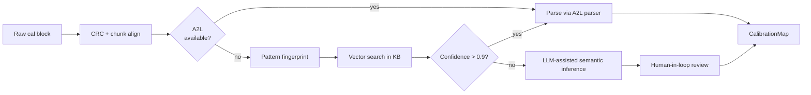

### 5.7 Checksum Validation

ECUs enforce integrity via:

- **OEM-specific algorithms** (Bosch ME/MED CSM, Siemens/Continental BSL).
- **AES-CMAC** or **RSA-PSS** signatures (post-2017 vehicles, mandated by UN R155).
- **Rolling checksums** for calibration chunks (CRC-32, Adler-32).

AutoTune AI integrates a **Checksum Service** that supports 300+ algorithms via plugin contracts. Any write-back operation refuses to proceed unless **all checksums validate** post-modification.

### 5.8 Firmware Identification

Firmware fingerprinting uses a **multi-hash** strategy:

| Hash Type | Purpose |
|---|---|
| `sha256` over full firmware | Exact identification |
| `tlsh` (locality-sensitive) | Detect tampered firmware variants |
| `ssdeep` | Fuzzy diff against known calibrations |
| Calibration-ID DID values | Logical version label |

Match → AutoTune KB → confidence score → eligible analysis tier.

---

## 6. Step 3 — AI Analysis of Calibration Tables

### 6.1 Analysis Surface

The AI reasons over the following calibration domains:

| Domain | Maps/Subsystems | Sample Outputs |
|---|---|---|
| **Fuel** | Injection mass, AFR target, lambda, multi-pulse split, fuel pressure | Mixture safety, knock margin, emissions risk |
| **Ignition** | Main spark, knock retard tables, dwell, MBT estimates | Detonation risk, MBT proximity |
| **Torque Request** | Driver torque demand, ECU arbitration, smoke limiter | Drivability, response |
| **Throttle Behavior** | Pedal map, ETC dynamics, anti-jerk filter | Linearity, lag |
| **Boost** | Wastegate duty, PID gains, target pressure | Overboost risk, turbine inlet temp |
| **AFR/Lambda Targets** | Catalyst protection, scavenging | Emission compliance, thermal margin |
| **Speed/Rev Limiters** | Hard/soft cuts, gear-based limits | Mechanical risk |
| **Cam Timing** | VVT/VVL maps | Overlap, scavenging, EGR effect |
| **Temperature Comp.** | Cold-start enrichment, thermal derate | Cold-start emissions, thermal protection |
| **Knock Behavior** | Knock threshold, retard slope, recovery | Sensor integrity, fuel quality robustness |
| **Driver Demand** | Pedal-to-torque mapping, sport modes | UX |
| **Gear-Dependent** | Per-gear torque limits, anti-lag | Drivetrain protection |

### 6.2 For Every Category — The "Six Questions"

For **every** calibration domain, the AI must produce a structured answer:

| Section | Description |
|---|---|
| **Explain** | Plain-language description of the maps and their function. |
| **Purpose** | The engineering intent and physical phenomena controlled. |
| **Inputs** | Sensor inputs, prior maps, vehicle states. |
| **Outputs** | Actuator effects, downstream subsystems. |
| **Relationships** | Cross-system coupling (e.g. boost ↔ ignition ↔ lambda). |
| **Opportunities** | Where calibration is sub-optimal vs. goals. |
| **Risks** | Failure modes, regulatory issues, component stress. |
| **AI Reasoning** | Chain-of-thought citing KB, similar vehicles, and physical models. |

### 6.3 Explainable AI Output Schema

```json
{
  "analysis_id": "an_01J9K3W7Y...",
  "domain": "ignition",
  "summary": "Ignition advance in the 2000–3500 rpm / 0.6–0.9 g/rev region is 3° more advanced than the median of 2,142 comparable EA888-evo4 vehicles. Knock margin estimated at 1.2° versus a safe threshold of 2°.",
  "evidence": [
    { "type": "kb_reference", "id": "kb:ea888-evo4-ign-baseline-v3" },
    { "type": "peer_cohort", "n": 2142, "median_advance": 18.5, "p95": 21.0 },
    { "type": "physical_model", "model": "knock-margin-v2", "output_deg": 1.2 }
  ],
  "opportunities": [...],
  "risks": [
    { "severity": "medium", "description": "Reduced knock margin → MON 91 fuel sensitivity", "mitigation": "Add 1.5° safety retard" }
  ],
  "confidence": 0.87,
  "safety_score": 0.78,
  "reasoning_trace": [
    "Loaded KB baseline for EA888-evo4.",
    "Computed delta against peer cohort.",
    "Ran knock-margin physical model.",
    "Cross-checked against OEM TSB 2024-EA888-09."
  ]
}
```

### 6.4 Reasoning Architecture

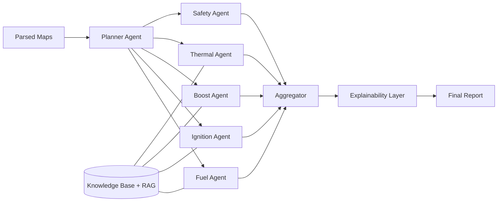

Each domain agent is implemented as a Claude-powered subagent with constrained tool use (RAG retriever, physical model calls, peer-cohort SQL).

---

## 7. Step 4 — Recommendation Engine

### 7.1 Goal Profiles

| Profile | Optimization Targets | Constraints |
|---|---|---|
| **Fuel Economy** | Lower BSFC, lean cruise, reduced pumping losses | NOx ≤ regulatory; drivability ≥ 0.7 |
| **Balanced** | OEM-style improvements | ±5% torque, ±3% economy |
| **Performance** | Torque/HP in mid-band | Knock margin ≥ 2°, EGT ≤ 920°C |
| **Track** | Wide-band power, response | Reliability score ≥ 0.6 (short duty) |
| **Towing** | Low-RPM torque, cooling headroom | EGT ≤ 800°C, ATF temp ≤ 110°C |
| **Fleet** | TCO optimization, predictability | Warranty compatible; emission stable |

### 7.2 Recommendation Output Schema

```json
{
  "rec_id": "rec_01J9K3W8AA...",
  "vio_id": "vio_01J9K3W7XQABCEFG",
  "profile": "balanced",
  "summary": "Estimated +18 Nm peak torque (2,000–3,500 rpm) and −2.4% fuel consumption in WLTP-like cycle.",
  "safety_score": 0.92,
  "confidence_score": 0.88,
  "compatibility_score": 0.95,
  "predicted_gains": {
    "torque_nm_peak": 18,
    "power_kw_peak": 9,
    "fuel_econ_delta_pct": -2.4,
    "0_100_kmh_delta_s": -0.4
  },
  "tradeoffs": [
    "Higher EGT under sustained WOT (+15°C)",
    "Slightly higher NOx in transients (+4%)"
  ],
  "proposed_changes": [
    { "map": "ignition_main", "region": [[2000,3500],[0.6,0.9]], "delta_deg": 1.0, "rationale": "..." },
    { "map": "boost_target",  "region": [[2200,3800]], "delta_kpa": 30, "rationale": "..." }
  ],
  "risk_assessment": {
    "knock": "low", "egt": "moderate", "trans": "low",
    "regulatory": "compliant under Euro 6e on-cycle"
  },
  "explanation": "Long-form professional rationale...",
  "simulation_only": true,
  "requires_tuner_signoff": true
}
```

### 7.3 Safety Net & Approval Workflow

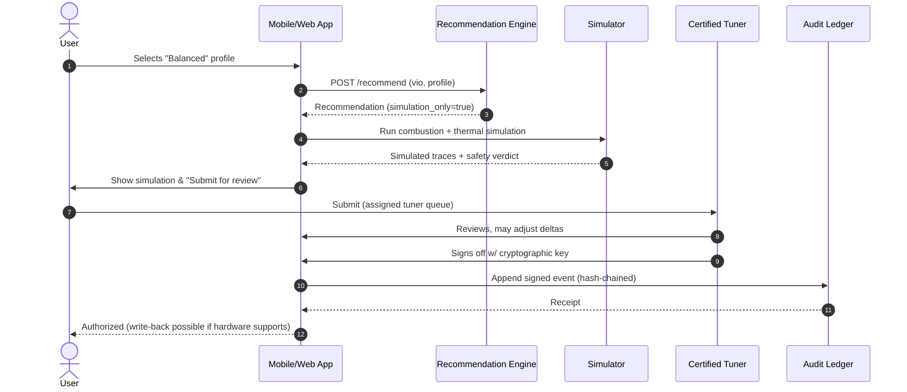

### 7.4 Risk Modeling

The risk assessment combines:

- **Physical models** (knock-margin, EGT, turbine surge, clutch torque capacity).
- **Statistical priors** from peer cohorts (failure incidence per modification).
- **Manufacturer service bulletins** indexed in KB.
- **Insurance / warranty rules** per region.

A Monte-Carlo simulator runs **2,000 stochastic drive cycles** per recommendation to compute risk distributions, not point estimates.

---

## 8. Step 5 — Live Monitoring Dashboard

### 8.1 Channels Monitored

| Category | Channels |
|---|---|
| **Engine speed/load** | RPM, MAP, MAF, throttle %, gear, vehicle speed |
| **Fuel** | AFR, lambda (front/rear), fuel trims (STFT/LTFT), injector duty cycle, fuel pressure |
| **Ignition** | Spark advance, knock retard (per cylinder), knock count |
| **Thermal** | Coolant, oil, ATF, EGT, IAT, ambient |
| **Boost** | Manifold pressure, wastegate duty, boost target, intake VVT, exhaust VVT |
| **Electrical** | Battery voltage, alternator load |
| **Derived** | Torque estimate, turbo efficiency, volumetric efficiency, health score |

### 8.2 Live Dashboard Layout (Mobile)

```
┌───────────────────────────────────────────┐
│  AutoTune AI — Live   ●●●● 4G   Vehicle ▼ │
├───────────────────────────────────────────┤
│  ┌─────┐ ┌─────┐ ┌─────┐ ┌─────┐         │
│  │ RPM │ │BOOST│ │ AFR │ │TIMG │         │
│  │ 4123│ │1.2  │ │13.8 │ │ 21° │         │
│  └─────┘ └─────┘ └─────┘ └─────┘         │
│  ┌─────┐ ┌─────┐ ┌─────┐ ┌─────┐         │
│  │COOL │ │ OIL │ │KNOCK│ │ EGT │         │
│  │ 92°C│ │105°C│ │  0  │ │820°C│         │
│  └─────┘ └─────┘ └─────┘ └─────┘         │
├───────────────────────────────────────────┤
│  RPM/Boost/Lambda    [graph 60s window]  │
│  ___/\___/\___                            │
├───────────────────────────────────────────┤
│  Health Score: 92/100   Alerts: 0         │
│  Prediction: O2 sensor B1S2 degrading 8w  │
└───────────────────────────────────────────┘
```

### 8.3 Alerts & Predictions

- **Hard alerts** — threshold-based (e.g. knock > 5 events / sec).
- **Soft alerts** — anomaly detection (z-score over moving baseline).
- **Predictive alerts** — gradient-boosted models estimate Remaining Useful Life (RUL) of sensors/actuators (O2, MAF, turbo, injectors).

### 8.4 Health Score

Composite 0–100 metric:

```
HealthScore = 0.30·Combustion + 0.20·Thermal + 0.20·Fuel + 0.15·Boost
             + 0.10·Electrical + 0.05·Diagnostics
```

Each sub-score is computed by a domain regressor trained on telemetry from fleet vehicles.

---

## 9. AI Engine Architecture

### 9.1 Architectural Overview

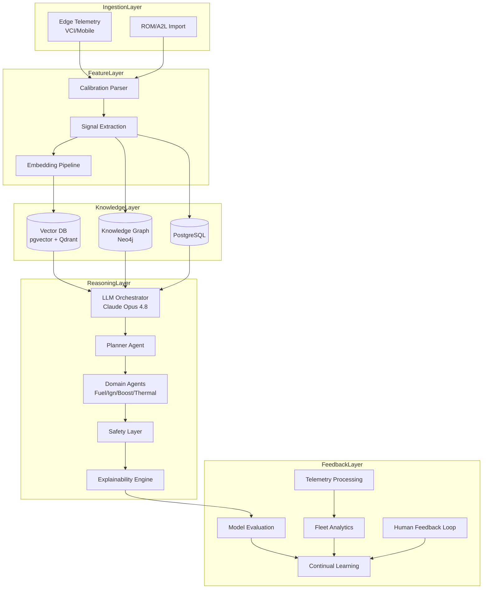

### 9.2 Components

#### 9.2.1 Claude API Layer
- **Primary model:** `claude-opus-4-8` for orchestration and complex reasoning.
- **Fast model:** `claude-sonnet-4-6` for high-volume domain agents.
- **Latency-sensitive:** `claude-haiku-4-5-20251001` for parser disambiguation, UI helper actions.
- All calls go through **Vercel AI Gateway** for failover, observability, and cost control.

#### 9.2.2 Retrieval-Augmented Generation (RAG)
- Source corpus: OEM service manuals, A2L files (licensed), SAE papers, forum knowledge (curated), TSBs.
- Indexing: `text-embedding-3-large` style 1536-d vectors, stored in **pgvector** (primary) + **Qdrant** (HA).
- Reranker: Cohere Rerank v4 or Voyage rerank-2.5.
- Retrieval pipeline: query expansion → hybrid (BM25 + ANN) → cross-encoder rerank → top-k=8.

#### 9.2.3 Knowledge Graph
- **Neo4j** stores entities: Vehicle, Engine, ECU, Map, Sensor, Calibration, TSB, Failure, Tuner.
- Relations: `EQUIPS`, `CALIBRATES`, `REFERENCES`, `RELATES_TO`, `CAUSES`, `MITIGATED_BY`.
- Cypher queries hydrate domain agents with structured context that pure vector search cannot deliver.

#### 9.2.4 Embedding Pipeline
- Streaming via **Kafka** (or AWS MSK) topics: `cal.raw`, `cal.parsed`, `cal.embedded`.
- Worker pool: **Celery + Ray Serve** for distributed embedding.
- Idempotency: SHA-256 of (calibration bytes + map id).

#### 9.2.5 LLM Orchestrator
- Implemented as a **planner-executor** loop.
- Planner emits structured tool calls (`retrieve_kb`, `run_simulation`, `query_cohort`, `domain_agent`).
- Executor runs tools in parallel with concurrency caps.
- Final aggregator runs a **verifier model** in adversarial mode.

#### 9.2.6 Reasoning Layer
- Each domain agent receives:
  - Parsed maps (canonical schema)
  - KB retrieval bundle
  - Peer cohort statistics
  - Physical model outputs
- Returns structured JSON conforming to **Analysis Schema v1**.

#### 9.2.7 Safety Layer
- Hard rules (deterministic):
  - Knock margin ≥ configurable minimum
  - EGT ≤ component limit (per engine family)
  - Boost ≤ turbo OEM map limit ± headroom
- Soft rules (probabilistic):
  - Statistical anomalies vs cohort
  - Confidence < 0.7 → mark as "advisory only"
- A recommendation that violates any **hard rule** is suppressed; the user sees a *Safety Veto* card.

#### 9.2.8 Explainability Engine
- Generates structured evidence chains.
- Maps every claim to a **citation** (KB doc, cohort statistic, physical model output).
- UI surfaces a "Why?" panel for every recommendation.

#### 9.2.9 Recommendation Engine
- Solver: constrained optimization over map deltas, with constraints from Safety Layer.
- Library: custom MILP/QP solver (Pyomo or OR-Tools) + ML surrogates for combustion/thermal.

#### 9.2.10 Learning Pipeline
- **Bronze → Silver → Gold** medallion architecture in S3/Delta Lake.
- Nightly batch jobs refresh cohort statistics, retrain RUL models.
- Online learning for telemetry anomaly detection (River library).

#### 9.2.11 Telemetry Processing
- Stream: Kafka topic `telemetry.live` (Avro schema).
- Consumers: anomaly detector, health-score updater, fleet aggregator.
- Storage: **TimescaleDB** for hot, **S3 Parquet** for cold.

#### 9.2.12 Fleet Analytics
- Multi-tenant rollups: per-organization, per-vehicle-family.
- Privacy: VINs hashed; aggregations enforce k≥20 anonymity.

#### 9.2.13 Model Evaluation
- Golden datasets per domain (≥500 labeled cases each).
- Metrics: F1 on map-identification, RMSE on gain prediction, calibration on confidence scores (ECE).
- **Adversarial verification**: 3-way panel for every released model.

#### 9.2.14 Human Feedback Loop
- Tuners flag analyses as *Accept*, *Adjust*, *Reject*.
- Adjusted deltas feed a Direct Preference Optimization (DPO) dataset for periodic fine-tuning of internal models.

#### 9.2.15 Prompt Engineering
- All prompts versioned in Git.
- A/B tested via Vercel AI Gateway routing.
- Hard-coded ontologies prevent free-form drift.

#### 9.2.16 Multi-Agent Architecture

| Agent | Responsibility |
|---|---|
| **Planner** | Decomposes user goal → subtasks |
| **Identifier** | Confirms VIO + map identities |
| **Fuel Agent** | Fuel & lambda |
| **Ignition Agent** | Spark & knock |
| **Boost Agent** | Air & boost |
| **Thermal Agent** | Cooling & EGT |
| **Drivetrain Agent** | Trans & torque limiters |
| **Safety Agent** | Veto authority |
| **Explainer** | Generates human-readable narrative |
| **Verifier** | Adversarial critique of recommendations |

---

## 10. Database Schema & Data Model

### 10.1 Logical Model (ER Highlights)

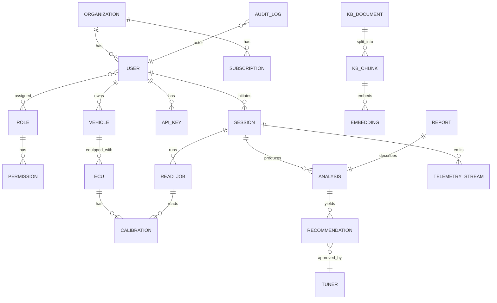

### 10.2 Selected Tables (PostgreSQL DDL highlights)

```sql
CREATE TABLE organizations (
  id UUID PRIMARY KEY DEFAULT gen_random_uuid(),
  name TEXT NOT NULL,
  legal_name TEXT,
  country_code CHAR(2) NOT NULL,
  tier TEXT NOT NULL CHECK (tier IN ('free','pro','workshop','enterprise','oem','gov')),
  created_at TIMESTAMPTZ DEFAULT now(),
  data_residency TEXT DEFAULT 'eu-west-1'
);

CREATE TABLE users (
  id UUID PRIMARY KEY DEFAULT gen_random_uuid(),
  org_id UUID REFERENCES organizations(id) ON DELETE CASCADE,
  email CITEXT UNIQUE NOT NULL,
  password_hash TEXT,
  mfa_secret_enc BYTEA,
  status TEXT NOT NULL DEFAULT 'active',
  created_at TIMESTAMPTZ DEFAULT now(),
  last_login_at TIMESTAMPTZ
);

CREATE TABLE roles (
  id UUID PRIMARY KEY,
  name TEXT UNIQUE NOT NULL,
  description TEXT
);

CREATE TABLE permissions (
  id UUID PRIMARY KEY,
  resource TEXT NOT NULL,
  action   TEXT NOT NULL,
  UNIQUE (resource, action)
);

CREATE TABLE role_permissions (
  role_id UUID REFERENCES roles(id),
  permission_id UUID REFERENCES permissions(id),
  PRIMARY KEY (role_id, permission_id)
);

CREATE TABLE user_roles (
  user_id UUID REFERENCES users(id),
  role_id UUID REFERENCES roles(id),
  PRIMARY KEY (user_id, role_id)
);

CREATE TABLE vehicles (
  id UUID PRIMARY KEY DEFAULT gen_random_uuid(),
  owner_user_id UUID REFERENCES users(id),
  vin CHAR(17) NOT NULL,
  vin_hash CHAR(64) NOT NULL,        -- for analytics k-anonymity
  make TEXT, model TEXT, model_year SMALLINT,
  engine_family TEXT,
  transmission TEXT,
  emission_standard TEXT,
  data JSONB NOT NULL DEFAULT '{}'::JSONB
);
CREATE INDEX idx_vehicles_vin_hash ON vehicles (vin_hash);

CREATE TABLE ecus (
  id UUID PRIMARY KEY,
  vehicle_id UUID REFERENCES vehicles(id) ON DELETE CASCADE,
  vendor TEXT, model TEXT,
  hw_pn TEXT, sw_pn TEXT, cal_id TEXT,
  fw_sha256 CHAR(64),
  protocols TEXT[]
);

CREATE TABLE sessions (
  id UUID PRIMARY KEY,
  user_id UUID REFERENCES users(id),
  vehicle_id UUID REFERENCES vehicles(id),
  vci_id UUID,
  started_at TIMESTAMPTZ DEFAULT now(),
  ended_at TIMESTAMPTZ,
  status TEXT DEFAULT 'open'
);

CREATE TABLE calibrations (
  id UUID PRIMARY KEY,
  ecu_id UUID REFERENCES ecus(id),
  source TEXT,                      -- 'read' | 'imported' | 'derived'
  bytes_sha256 CHAR(64),
  size_bytes BIGINT,
  storage_uri TEXT,                 -- s3://...
  parsed BOOLEAN DEFAULT FALSE,
  created_at TIMESTAMPTZ DEFAULT now()
);

CREATE TABLE calibration_maps (
  id UUID PRIMARY KEY,
  calibration_id UUID REFERENCES calibrations(id),
  name TEXT, semantic_tag TEXT,
  axes JSONB, value_units TEXT,
  values BYTEA,                     -- compact binary (parquet/zstd reference)
  storage_uri TEXT
);

CREATE TABLE analyses (
  id UUID PRIMARY KEY,
  session_id UUID REFERENCES sessions(id),
  model_version TEXT,
  output JSONB NOT NULL,
  confidence NUMERIC(4,3),
  safety_score NUMERIC(4,3),
  created_at TIMESTAMPTZ DEFAULT now()
);

CREATE TABLE recommendations (
  id UUID PRIMARY KEY,
  analysis_id UUID REFERENCES analyses(id),
  profile TEXT,
  output JSONB NOT NULL,
  status TEXT DEFAULT 'simulated',  -- simulated | pending_review | approved | rejected | applied
  approved_by UUID REFERENCES users(id),
  approved_at TIMESTAMPTZ
);

CREATE TABLE telemetry_streams (
  id UUID PRIMARY KEY,
  session_id UUID REFERENCES sessions(id),
  started_at TIMESTAMPTZ,
  channels TEXT[]
);

CREATE TABLE telemetry_points (
  stream_id UUID NOT NULL,
  ts TIMESTAMPTZ NOT NULL,
  channel TEXT NOT NULL,
  value DOUBLE PRECISION,
  PRIMARY KEY (stream_id, channel, ts)
) PARTITION BY RANGE (ts);
-- TimescaleDB hypertable in production

CREATE TABLE reports (
  id UUID PRIMARY KEY,
  analysis_id UUID REFERENCES analyses(id),
  pdf_uri TEXT,
  signed_by_tuner_id UUID,
  signature BYTEA,
  hash_chain CHAR(64) NOT NULL
);

CREATE TABLE kb_documents (
  id UUID PRIMARY KEY,
  source TEXT, title TEXT,
  license TEXT, ingested_at TIMESTAMPTZ
);

CREATE TABLE kb_chunks (
  id UUID PRIMARY KEY,
  document_id UUID REFERENCES kb_documents(id),
  text TEXT,
  metadata JSONB
);

-- Vector column
ALTER TABLE kb_chunks ADD COLUMN embedding VECTOR(1536);
CREATE INDEX idx_kb_chunks_embed ON kb_chunks USING ivfflat (embedding vector_cosine_ops) WITH (lists=200);

CREATE TABLE subscriptions (
  id UUID PRIMARY KEY,
  org_id UUID REFERENCES organizations(id),
  plan TEXT,
  status TEXT,
  current_period_end TIMESTAMPTZ
);

CREATE TABLE api_keys (
  id UUID PRIMARY KEY,
  org_id UUID REFERENCES organizations(id),
  prefix CHAR(8),
  hash CHAR(64),
  scopes TEXT[],
  created_at TIMESTAMPTZ DEFAULT now(),
  revoked_at TIMESTAMPTZ
);

CREATE TABLE tuners (
  id UUID PRIMARY KEY,
  user_id UUID REFERENCES users(id),
  certification_level TEXT,        -- L1, L2, L3, OEM
  certifying_authority TEXT,
  signing_pubkey TEXT,
  status TEXT DEFAULT 'active'
);

CREATE TABLE audit_logs (
  id BIGSERIAL PRIMARY KEY,
  ts TIMESTAMPTZ DEFAULT now(),
  actor_user_id UUID,
  action TEXT,
  resource_type TEXT,
  resource_id TEXT,
  payload JSONB,
  prev_hash CHAR(64),
  hash CHAR(64) NOT NULL           -- hash-chained
);
```

### 10.3 Indexes & Performance

| Table | Indexes | Notes |
|---|---|---|
| `vehicles` | `(vin_hash)`, `(owner_user_id)` | VIN PII protection |
| `sessions` | `(user_id, started_at DESC)` | dashboards |
| `analyses` | `(session_id)`, GIN `(output)` | JSONB search |
| `telemetry_points` | TimescaleDB hypertable on `ts` | partition + compression |
| `kb_chunks` | IVFFLAT vector index | tuned `lists=sqrt(N)` |
| `audit_logs` | `(actor_user_id, ts)`, `(resource_type, resource_id)` | hash-chain integrity |

### 10.4 Data Lifecycle

- **Hot** (PostgreSQL/Timescale) — 90 days operational data.
- **Warm** (S3 Parquet / Delta Lake) — 1–5 years analytical.
- **Cold** (Glacier Deep Archive) — 5–10 years for regulatory traceability.

---

## 11. Backend & Cloud Architecture

### 11.1 Service Catalog

| Service | Tech | Purpose |
|---|---|---|
| `api-gateway` | NGINX + AWS API Gateway | Public ingress, WAF, rate-limit |
| `auth-svc` | FastAPI + Keycloak | OAuth2/OIDC, MFA, JWT issuance |
| `vehicle-svc` | FastAPI + Postgres | VIO management |
| `ecu-svc` | FastAPI + Postgres + S3 | ECU & calibration storage |
| `read-svc` | Python + asyncio | Orchestrates VCI read jobs |
| `analysis-svc` | Python + Ray + Celery | LLM orchestration |
| `recommendation-svc` | Python + OR-Tools | Constrained optimization |
| `simulation-svc` | C++/Rust + gRPC | High-perf combustion/thermal sims |
| `monitoring-svc` | Python + Timescale | Live telemetry ingest |
| `kb-svc` | Python + pgvector + Qdrant | RAG |
| `report-svc` | Python + WeasyPrint | Signed PDF |
| `billing-svc` | Stripe + Paddle | Subscriptions |
| `notification-svc` | Node + WebPush + Twilio | Alerts |
| `audit-svc` | Rust | Append-only hash-chained log |

### 11.2 Stack

- **Language:** Python 3.13 (services), Rust (audit, hot-path), C++ (sim), TypeScript (web).
- **Framework:** FastAPI + Pydantic v2.
- **Async tasks:** Celery + Redis broker (default), RabbitMQ for high-throughput durable queues.
- **Streaming:** Kafka (MSK) for telemetry; SNS/SQS for control plane.
- **Containers:** Docker, multi-stage builds, distroless base.
- **Orchestration:** Kubernetes (EKS primary, AKS DR).
- **Service mesh:** Istio (mTLS everywhere).
- **Secrets:** AWS Secrets Manager + HashiCorp Vault (cross-cloud).
- **IaC:** Terraform + Helm.
- **Cloud Multi-region:** AWS `eu-west-1`, `us-east-1`, `ap-southeast-1`; Azure `westeurope` (DR).

### 11.3 Cloud Topology

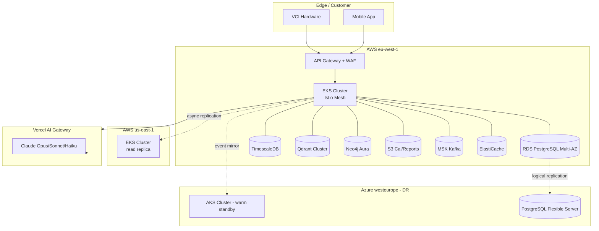

### 11.4 Authentication & Authorization

- **OAuth2 + OIDC** via Keycloak (self-hosted) for human auth.
- **OAuth2 client credentials** for machine-to-machine (M2M).
- **JWT** access tokens (RS256, 15-minute TTL) + refresh tokens (rotating).
- **MFA:** TOTP + WebAuthn passkeys (FIDO2). Workshop tier requires MFA.
- **RBAC + ABAC** combined: roles define base, attributes (org_id, vehicle_id, region) enforce row-level security via PostgreSQL RLS.
- **Tuner signing keys** stored in HSM (AWS CloudHSM) — recommendations are signed with tuner private key.

### 11.5 API Conventions

- REST + JSON for control plane.
- gRPC for internal high-throughput (VCI ↔ read-svc, sim-svc).
- WebSocket / Server-Sent Events for live telemetry.
- Versioning: `/v1/`, deprecation policy 18 months.
- Pagination: cursor-based (`?after=...&limit=50`).
- Idempotency: `Idempotency-Key` header for POST.
- Errors: RFC 7807 Problem Details.

### 11.6 Caching Strategy

| Layer | Tech | TTL | Use |
|---|---|---|---|
| CDN | CloudFront | 1 h | Static, marketing |
| API edge | CloudFront + Lambda@Edge | 30 s | Public docs, KB previews |
| App | Redis | 5 m | User session, VIO cache |
| DB | PostgreSQL materialized views | hourly | Cohort statistics |
| AI | Anthropic prompt cache | 5 m | Repeated prompts |

### 11.7 Scaling

- **Horizontal pod autoscaler** (CPU + custom metrics).
- **KEDA** triggers on Kafka lag, RabbitMQ depth.
- **Sharding** strategy: per-org for `analyses`, `telemetry_points`.
- **Connection pooling** via PgBouncer in transaction mode.

### 11.8 Rate Limiting

- Global: 1,000 req/min/IP (anonymous).
- Authenticated: per-tier (Free 60 rpm, Pro 600, Workshop 6k, Enterprise 60k).
- Per-endpoint cost weighting (LLM endpoints cost 10–50 units).
- Implementation: **Envoy** with Redis token-bucket.

### 11.9 Observability

| Concern | Stack |
|---|---|
| Logs | OpenTelemetry + Loki + Grafana |
| Metrics | Prometheus + Mimir + Grafana |
| Traces | OpenTelemetry + Tempo |
| RUM | Sentry + custom OpenTelemetry SDK |
| Alerting | Grafana OnCall + PagerDuty |
| SLOs | Sloth/PromQL — 99.9% API, 99.5% AI, 99.95% Auth |

---

## 12. Mobile Application (React Native)

### 12.1 Tech Stack

- **React Native 0.78** (New Architecture, Fabric, TurboModules).
- **Expo Modules SDK** for native bridges where appropriate.
- **State:** Zustand + TanStack Query.
- **Forms:** React Hook Form + Zod.
- **Charts:** Victory Native XL (Skia-based).
- **Bluetooth (BLE VCI):** `react-native-ble-plx`.
- **USB-OTG (Android):** `react-native-usb-serial-for-android`.
- **Wi-Fi / mDNS (DoIP gateway over Wi-Fi):** custom native module.
- **Offline:** SQLite (op-sqlite) + WatermelonDB.
- **Theming:** Tamagui or NativeWind, full **dark-mode** by default.
- **i18n:** `react-intl` (initial locales: EN, FR, DE, AR, ZH).

### 12.2 Screen Map

| Screen | Purpose | Key Components |
|---|---|---|
| **Onboarding** | First-run, account, MFA | Wizard, biometric setup |
| **Login** | Auth | Email/passkey, SSO |
| **Garage** | Vehicle list | Vehicle cards, add via VIN/scan |
| **Vehicle** | Detail of selected vehicle | VIO panel, history |
| **Scan** | Live ECU read | Progress, protocol log |
| **Analysis** | AI breakdown | Domain cards, evidence drawer |
| **Recommendations** | Goal selection & output | Profile chooser, gain estimator |
| **Reports** | PDF list & viewer | Signed report viewer |
| **Monitoring** | Live dashboard | Gauges, graphs, alerts |
| **History** | Session log | Timeline, filter |
| **Settings** | App + account | Theme, language, units |
| **Subscription** | Plan & billing | Stripe sheet |
| **Notifications** | Alerts | Push & in-app |
| **Support** | Help & chat | Tickets, FAQ, live chat |
| **Profile** | User info, security | MFA, sessions, keys |

### 12.3 Wireframe (Mermaid)

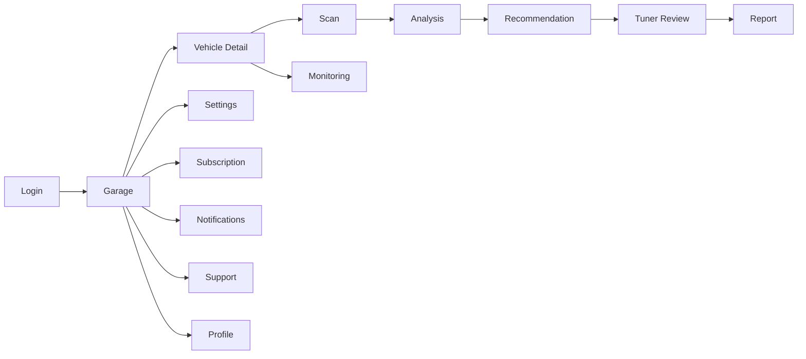

### 12.4 Garage Screen (ASCII Wireframe)

```
┌──────────────────────────────────────┐
│  ≡   AutoTune AI         🔔   👤     │
├──────────────────────────────────────┤
│  My Garage                  + Add    │
│                                      │
│  ┌──────────────────────────────┐    │
│  │ 🚗 Audi A4 45 TFSI · 2025    │    │
│  │ EA888 evo4 · Bosch MG1CS111  │    │
│  │ Health 92 / 100  · 3 alerts  │    │
│  └──────────────────────────────┘    │
│  ┌──────────────────────────────┐    │
│  │ 🚙 BMW M340i · 2024          │    │
│  │ B58TU2 · Continental SIMOS21 │    │
│  │ Health 88 / 100  · 0 alerts  │    │
│  └──────────────────────────────┘    │
├──────────────────────────────────────┤
│  [Scan]  [Reports]  [Monitor] [Pro]  │
└──────────────────────────────────────┘
```

### 12.5 Offline & Sync

- All reads stored locally (SQLite); upload to cloud when online.
- Conflict resolution: last-writer-wins per `session_id` (sessions are append-only).
- Background sync via `react-native-background-fetch`.

### 12.6 Security on Device

- Secrets in iOS Keychain / Android Keystore.
- Certificate pinning (TrustKit).
- Jailbreak/root detection (Freerasp).
- Biometric unlock for sensitive flows.
- App Attestation (DeviceCheck/App Attest, Play Integrity).

---

## 13. Web Dashboard (Workshops & Fleet)

### 13.1 Stack

- **Next.js 16 App Router** with React Server Components.
- **Cache Components** (PPR, `use cache`, `cacheLife`, `cacheTag`).
- **Auth:** Clerk (Vercel Marketplace) federated with Keycloak.
- **UI:** shadcn/ui + Tailwind CSS.
- **Charts:** Recharts + d3.
- **Realtime:** WebSocket + Server-Sent Events.
- **Deployment:** Vercel Fluid Compute (Node 24).

### 13.2 Modules

| Module | Features |
|---|---|
| **Fleet Management** | Vehicle inventory, health rollups, geo |
| **Customer Management** | CRM-lite, contact history |
| **Reports** | Filtered list, downloads, signing chain |
| **Analytics** | Cohort dashboards, predictive KPIs |
| **Revenue** | MRR/ARR, churn, LTV |
| **Subscriptions** | Plan mgmt, invoices, dunning |
| **Technicians** | Roster, certifications, sign-off queues |
| **Permissions** | RBAC editor, audit |
| **Appointments** | Bookings, calendar (CalDAV import) |
| **Marketplace** | OEM tools, third-party integrations |

### 13.3 Information Architecture

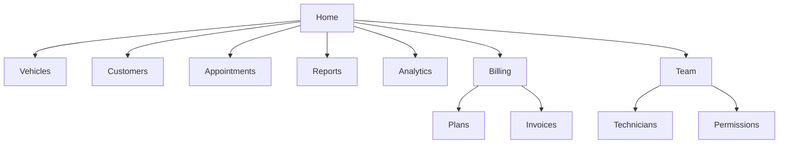

---

## 14. Cybersecurity & Compliance

### 14.1 Threat Model (STRIDE)

| Threat | Surface | Mitigation |
|---|---|---|
| **Spoofing** | Auth, VCI identity | OIDC + WebAuthn + device attestation |
| **Tampering** | Calibration files | SHA-256 + tuner signatures + audit chain |
| **Repudiation** | Tuner actions | Cryptographic signatures + HSM |
| **Information Disclosure** | VIN, PII | Field-level encryption, k-anonymity |
| **Denial of Service** | Public APIs | WAF, rate-limit, autoscale |
| **Elevation of Privilege** | RBAC bugs | Policy-as-code (OPA), least privilege |

### 14.2 Defense-in-Depth Layers

1. **Edge (CDN/WAF)** — CloudFront + AWS WAF + Vercel Firewall + Vercel BotID.
2. **Identity** — Keycloak/Clerk + MFA + passkeys + risk-based auth.
3. **Network** — VPC isolation, private subnets, PrivateLink, mTLS via Istio.
4. **App** — input validation (Pydantic), output encoding, CSP, secure headers.
5. **Data** — KMS-backed encryption at rest, TLS 1.3 in transit, field-level for VIN/PII.
6. **Runtime** — Falco, gVisor for untrusted code, eBPF runtime threat detection.
7. **Supply Chain** — Sigstore, SLSA L3, SBOM via Syft, image signing.

### 14.3 Certificate Pinning

- Mobile: pin Vercel + AWS API endpoints with primary & backup pins.
- VCI firmware: pinned root CA; refuses connections outside `*.autotune.ai`.

### 14.4 Secrets Management

- HashiCorp Vault for dynamic credentials.
- AWS Secrets Manager for AWS-native services.
- All secrets rotated ≤ 90 days.
- No plaintext secrets in env files committed to Git.

### 14.5 Encryption

| Data | At Rest | In Transit | Field-level |
|---|---|---|---|
| User PII | AES-256 (KMS) | TLS 1.3 | AES-GCM with envelope keys |
| VIN | AES-256 + hash for analytics | TLS 1.3 | Tokenized |
| Calibrations | AES-256 | TLS 1.3 | Object-level |
| Reports | AES-256 | TLS 1.3 | Sealed (recipient pubkey) |

### 14.6 Audit Logging

- Hash-chained append-only ledger.
- Stored in PostgreSQL + replicated to immutable S3 Object Lock.
- WORM compliance for OEM/Gov tier.

### 14.7 Threat Detection

- **SIEM:** Elastic Security or Panther.
- **EDR:** CrowdStrike Falcon on servers.
- **Cloud posture:** Wiz / Prisma Cloud.
- **Anomaly detection:** UEBA on user/API behavior.

### 14.8 Zero-Trust

- No implicit trust between services.
- Every call authenticated via SPIFFE/SPIRE workload identity.
- Continuous verification — short-lived tokens (≤ 1 h).

### 14.9 OWASP Mapping

| OWASP Top 10 | Control |
|---|---|
| A01 Broken Access Control | RBAC + ABAC + RLS + integration tests |
| A02 Crypto Failures | KMS, TLS 1.3, no MD5/SHA1 |
| A03 Injection | Pydantic, parameterized queries |
| A04 Insecure Design | Threat modeling per service |
| A05 Misconfiguration | IaC scanning, CIS benchmarks |
| A06 Vulnerable Components | Renovate + Snyk + OSV |
| A07 Auth Failures | MFA, lockout, captcha |
| A08 Software & Data Integrity | Sigstore, SLSA |
| A09 Logging | OpenTelemetry, audit ledger |
| A10 SSRF | Egress proxies, allow-lists |

### 14.10 Regulatory Compliance

- **GDPR** (EU) — DPIA, DPO, right to access/erasure, data residency.
- **CCPA/CPRA** (CA).
- **UN R155 / R156** — vehicle cybersecurity & software updates.
- **ISO/SAE 21434** — automotive cybersecurity engineering.
- **ISO 26262** — functional safety alignment (advisory mode; AutoTune AI is not safety-critical control).
- **SOC 2 Type II** — annual audit.
- **ISO 27001** — ISMS certified.
- **HIPAA** — N/A (no PHI).
- **PCI-DSS SAQ A** — payments outsourced to Stripe/Paddle.

---

## 15. AI Knowledge Base

### 15.1 Sources

| Source | License | Volume |
|---|---|---|
| OEM service manuals (licensed) | Negotiated | ~50K docs |
| A2L/CDF calibration descriptions | OEM/Tier-1 | ~12K files |
| SAE / IEEE technical papers | Subscription | ~80K abstracts |
| TSBs / NHTSA / KBA recalls | Public | ~120K records |
| Curated forum knowledge | CC-BY + curated | ~250K posts |
| Internal calibration corpus | Proprietary | ~4M data points |
| Telemetry-derived priors | Internal | continually updated |

### 15.2 Ingestion Pipeline

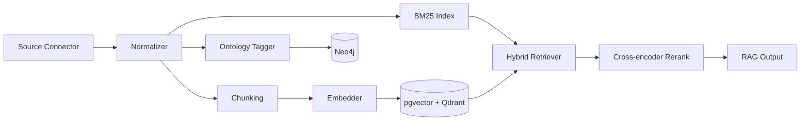

### 15.3 Vehicle/Engine Taxonomy

- **Manufacturer → Brand → Platform → Engine Family → Variant → ECU → Calibration**.
- Stored in Neo4j with stable URIs (e.g. `autotune://taxonomy/vw/ea888-evo4-gen3b/mg1cs111`).

### 15.4 Semantic Search

- Hybrid (BM25 + ANN) with query rewriting (HyDE).
- Filters: vehicle, engine family, region, year range, source type.
- Latency target P95 < 250 ms.

### 15.5 Knowledge Graph Use Cases

- Multi-hop reasoning ("What TSBs affect EA888 evo4 cam timing across all Audi platforms?").
- Constraint hydration ("Which ECUs share calibration semantics with MG1CS111?").
- Causal chains for failure mode analysis.

### 15.6 Versioning

- Every chunk has `(source_uri, version, valid_from, valid_to)`.
- Vector index supports temporal queries.

---

## 16. Business Model & Financials

### 16.1 Pricing Tiers

| Tier | Audience | Price (USD) | Features |
|---|---|---|---|
| **Free** | Curious / students | $0 | OBD-II read, basic VIO, 3 analyses/mo |
| **Pro** | Enthusiasts | $19/mo | Full read (J2534), live monitor, 50 analyses/mo |
| **Workshop** | Independent shops | $199/mo per seat | Unlimited reads, tuner workflow, white-label reports |
| **Enterprise** | Large dealer groups | $2,500/mo + usage | SSO, RBAC, audit ledger export, SLA 99.95% |
| **OEM** | Manufacturers / Tier-1 | $100K–$1M/yr | Private KB, on-prem option, dedicated AI |
| **Government** | Regulators / type-approval | Custom | WORM ledger, court-ready reports |

### 16.2 Licensing & Marketplace

- **Hardware:** AutoTune VCI Pro ($499) and VCI OEM ($2,499).
- **API Licensing:** $0.02 per analysis call, $0.001 per telemetry event ingested.
- **Marketplace:** 15% take rate on third-party plugins (OEM-specific A2L packs, regional emissions packs).

### 16.3 Revenue Projections (5-Year)

| Year | Users (Pro) | Workshops | Enterprise | OEM | ARR (USD) |
|---|---|---|---|---|---|
| Y1 | 12,000 | 350 | 5 | 1 | $5.4M |
| Y2 | 45,000 | 1,200 | 25 | 4 | $24.1M |
| Y3 | 110,000 | 3,000 | 80 | 10 | $68.5M |
| Y4 | 220,000 | 6,500 | 200 | 18 | $146M |
| Y5 | 380,000 | 11,000 | 420 | 28 | $254M |

### 16.4 Cost Structure

- Cloud (AWS/Azure/Vercel): 18% of revenue.
- Anthropic Claude API: 9% of revenue (heavily cached + tiered).
- Engineering: 28% (until Y3, then ↓ to 22%).
- Sales & marketing: 22%.
- G&A: 8%.
- Compliance & legal: 6%.

### 16.5 Funding Plan

| Round | Year | Amount | Use |
|---|---|---|---|
| Pre-seed | Y0 | $750K | MVP, J2534 prototype |
| Seed | Y0.5 | $4M | Core team, KB licensing |
| Series A | Y1 | $18M | Multi-region, workshop GTM |
| Series B | Y2.5 | $55M | OEM partnerships, hardware |
| Series C | Y4 | $120M | Global scale + EV expansion |

---

## 17. Roadmap & Hiring Plan

### 17.1 Roadmap

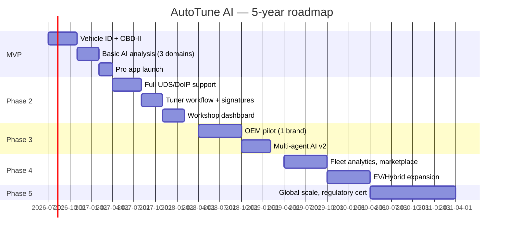

### 17.2 Hiring Plan

| Role | Y0 | Y1 | Y2 | Y3 | Y5 |
|---|---|---|---|---|---|
| Software Engineers | 6 | 18 | 38 | 65 | 110 |
| AI / ML Engineers | 3 | 8 | 16 | 28 | 45 |
| Automotive Engineers | 2 | 5 | 10 | 18 | 30 |
| Cybersecurity | 1 | 3 | 6 | 10 | 18 |
| DevOps / SRE | 1 | 4 | 8 | 14 | 24 |
| Product & UX | 2 | 5 | 10 | 16 | 28 |
| GTM (Sales+CS) | 1 | 8 | 22 | 45 | 90 |
| G&A | 2 | 5 | 10 | 20 | 38 |
| **Total** | **18** | **56** | **120** | **216** | **383** |

### 17.3 Risk Register

| Risk | Likelihood | Impact | Mitigation |
|---|---|---|---|
| OEM legal pushback on calibration access | High | High | OEM partnership program, no firmware writes by default |
| LLM hallucination causing engine damage | Medium | Catastrophic | Safety Layer veto, simulation-only, tuner sign-off |
| Cyber incident leaking VINs | Low | High | Encryption, tokenization, SOC2, bug bounty |
| Hardware supply chain (VCI) | Medium | Medium | Dual sourcing (NXP, ST, Renesas) |
| AI cost explosion | Medium | Medium | Tiered models, caching, on-prem inference for hot paths |
| Regulatory (UN R155 enforcement) | High | Medium | Compliance from day one |
| Talent acquisition (auto + AI) | High | Medium | Remote-first, RSU, training pipeline |

### 17.4 Technical Debt Policy

- 20% of every sprint allocated to maintenance, refactor, and tests.
- Quarterly architecture reviews.
- Mandatory deprecation timelines for any v1 API.

---

## 18. Investor Documentation

### 18.1 Executive Summary

AutoTune AI is the first cloud-native, explainable-AI platform for ECU intelligence. It enables professional tuners, workshops, fleets, and OEMs to safely understand and improve vehicle calibration with full traceability — closing a $14B+ market gap left by legacy tools.

### 18.2 Problem

- 1.4B+ ICE/hybrid vehicles in operation through 2040.
- Aftermarket tuning is a $40B/yr industry — but tribal, opaque, and dangerous: ~12% of tuned engines suffer premature failure within 24 months.
- Workshops face workforce shortages (NA: 80K open positions in 2026).
- Regulators demand traceability post-UN R155 — legacy tools cannot comply.

### 18.3 Solution

A safety-first, explainable AI co-pilot for calibration:
- Identifies, reads, analyzes, simulates, recommends.
- Tuner-in-the-loop with cryptographic accountability.
- Cloud + edge architecture, multi-tenant, multi-region.

### 18.4 Market

- TAM: $78B; SAM: $14.6B; SOM (5y): $480M.
- Tailwinds: regulator mandates, technician shortage, EV/Hybrid hybrid-cal complexity, fleet electrification audit needs.

### 18.5 Competition

| Competitor | Strength | Gap AutoTune AI Closes |
|---|---|---|
| HP Tuners | Mature ECU library | No AI, no audit, no fleet |
| EcuTek | Pro workflow | No explainability, single-vehicle |
| Cobb / SCT | Brand-specific | Narrow vehicle coverage |
| Bosch ESI[tronic] | OEM-grade | No AI tuning workflow |
| Snap-on / Launch | Diagnostics | No calibration intelligence |

### 18.6 Unique Value Proposition

> *"The only AI calibration platform that explains every recommendation, refuses unsafe actions by design, and produces signed, regulator-ready reports — across every major ECU, on every device."*

### 18.7 Technology Moat

- 4M+ curated calibration data points (5-year lead).
- OEM partnerships with NDA-protected A2L access.
- Patented Safety Layer + signed-report ledger (patents pending in EU/US/CN).
- Multi-agent reasoning specialized per powertrain domain.

### 18.8 Go-To-Market

1. **Land:** prosumer & enthusiast via app stores (Pro tier).
2. **Expand:** workshops via direct sales + reseller program.
3. **Anchor:** OEM pilots → multi-year contracts.
4. **Defend:** marketplace for third-party A2L packs, hardware ecosystem.

### 18.9 Competitive Advantage

- Network effects: more tunes → richer KB → better AI.
- Switching costs: signed report archives, workshop workflow lock-in.
- Compliance moat: only platform meeting UN R155/R156 audit-ready out of the box.

### 18.10 SWOT

| | Internal | External |
|---|---|---|
| **Positive** | Strong AI tech, safety DNA, automotive domain depth | Regulatory tailwinds, AI hype maturity |
| **Negative** | Hardware supply complexity, OEM dependence | OEM lock-down, EV transition disruption |

### 18.11 Pitch Deck Outline

1. Hook — "12% of tuned cars die. We fix that."
2. Problem
3. Solution
4. Demo (10s video)
5. Market
6. Product walkthrough
7. Technology (architecture diagram)
8. Traction & pilots
9. Business model
10. Competition
11. Go-to-market
12. Team
13. Financials
14. The Ask

---

## 19. Architecture Diagrams (Mermaid)

### 19.1 System Architecture

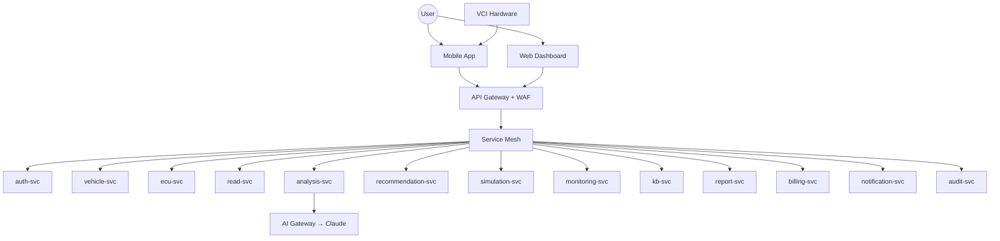

### 19.2 Cloud Architecture (Multi-Region)

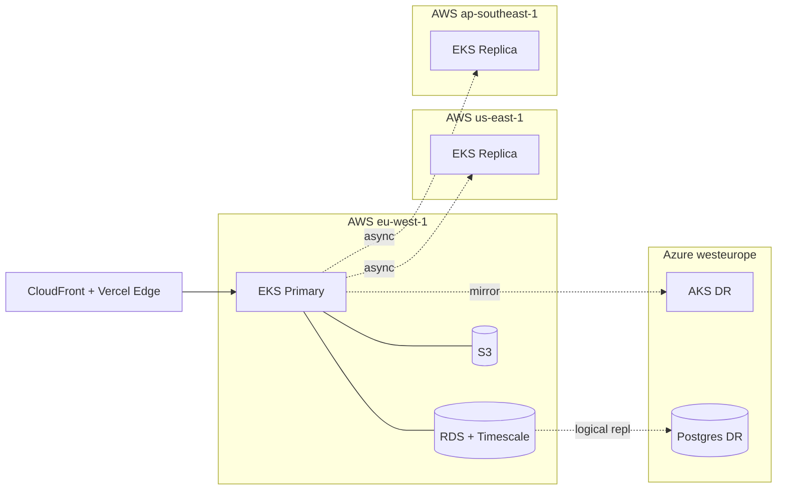

### 19.3 Microservices

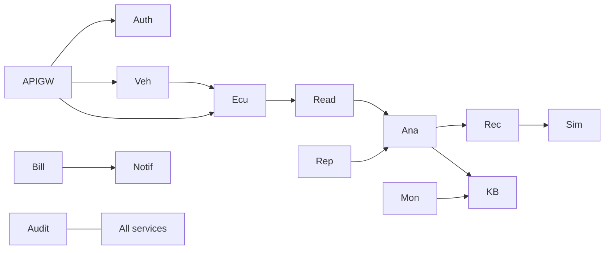

### 19.4 Database ERD

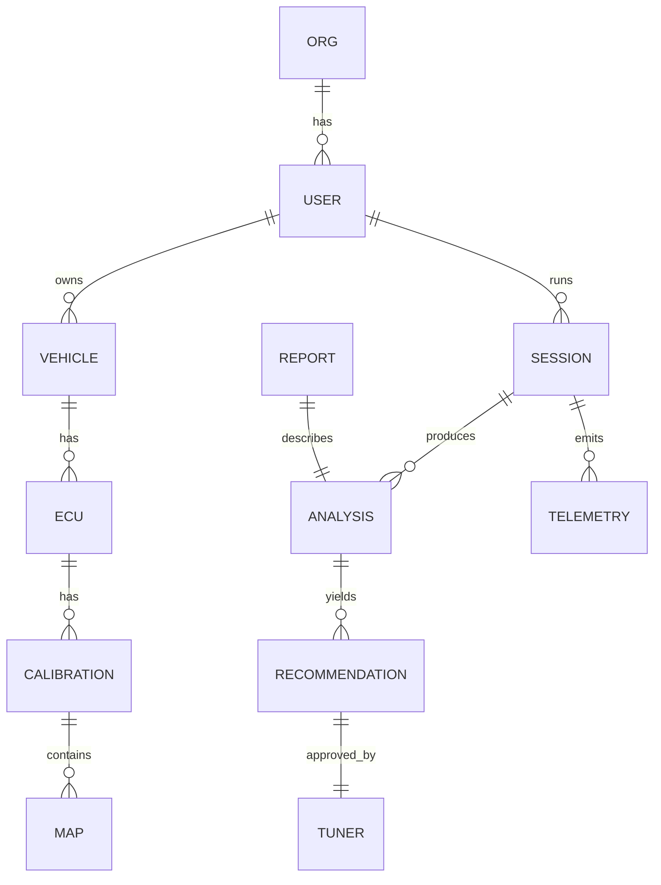

### 19.5 AI Pipeline

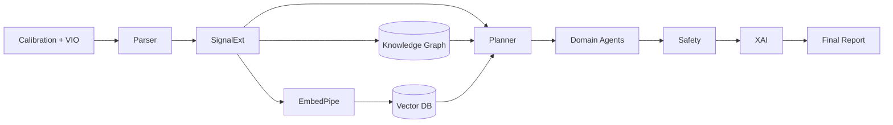

### 19.6 User Flow

```mermaid
flowchart LR
    Open[Open App] --> Login
    Login --> Garage
    Garage --> Connect[Connect VCI]
    Connect --> Scan
    Scan --> Identify
    Identify --> Read
    Read --> Analyze
    Analyze --> ChooseProfile
    ChooseProfile --> Recommend
    Recommend --> Simulate
    Simulate --> TunerReview
    TunerReview --> Report
    Report --> Save
```

### 19.7 Mobile Architecture

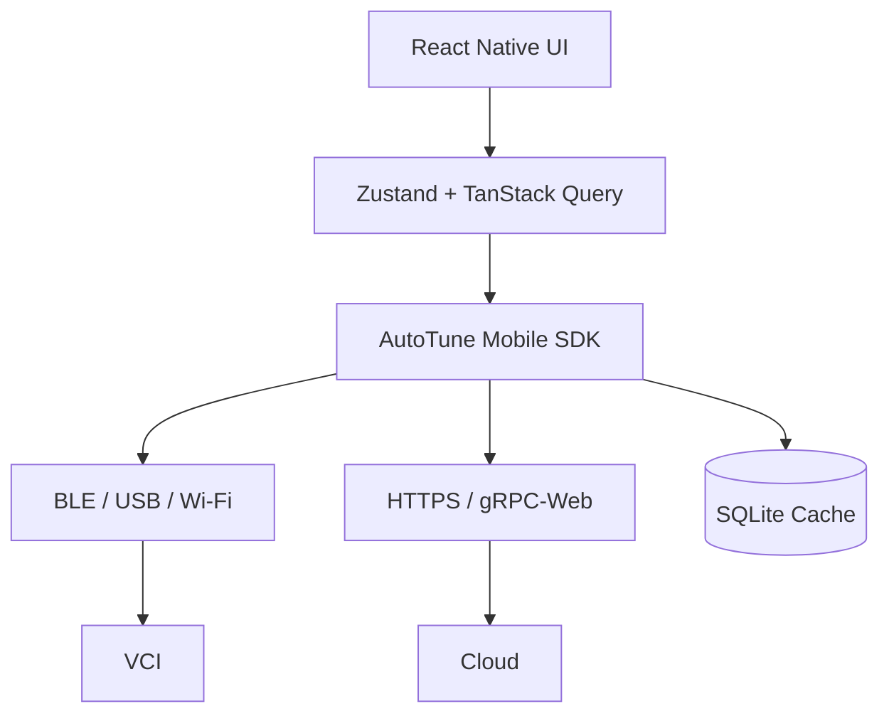

### 19.8 Backend Architecture

```mermaid
flowchart TB
    Ingress --> Envoy
    Envoy --> Istio
    Istio --> Services
    Services --> RDS[(PostgreSQL)]
    Services --> Cache[(Redis)]
    Services --> Queue[(Celery/Rabbit/Kafka)]
    Services --> Obj[(S3)]
    Services --> AI[Claude via Gateway]
```

### 19.9 Authentication Flow

```mermaid
sequenceDiagram
    actor U as User
    participant App
    participant AGW as API Gateway
    participant KC as Keycloak
    participant Svc as Backend Svc
    U->>App: Login (email + passkey)
    App->>AGW: /auth/login
    AGW->>KC: OIDC code flow
    KC-->>AGW: ID + Access + Refresh tokens
    AGW-->>App: tokens
    App->>AGW: GET /vehicles (Bearer JWT)
    AGW->>Svc: forward + propagate trace
    Svc->>Svc: verify JWT (JWKS), RLS
    Svc-->>App: data
```

### 19.10 Deployment Diagram

```mermaid
flowchart TB
    Dev[Developer] -->|push| Git[GitHub]
    Git --> CI[GitHub Actions CI]
    CI --> Test[Unit + Integration Tests]
    CI --> SAST[Snyk + Semgrep]
    CI --> Build[Docker Build + SBOM]
    Build --> Reg[ECR + signed via Sigstore]
    Reg --> CD[ArgoCD]
    CD --> EKS[EKS Clusters]
    EKS --> Prod[Production Pods]
    Prod --> Obs[OpenTelemetry → Grafana/Loki/Tempo]
```

---

## 20. Appendices

### Appendix A — Glossary

| Term | Meaning |
|---|---|
| **ECU** | Electronic Control Unit |
| **A2L** | ASAP2 description file for calibration variables |
| **DID** | Data Identifier (UDS) |
| **DoIP** | Diagnostics over IP |
| **UDS** | Unified Diagnostic Services (ISO 14229) |
| **KWP2000** | Keyword Protocol 2000 |
| **MBT** | Minimum spark advance for Best Torque |
| **EGT** | Exhaust Gas Temperature |
| **AFR** | Air-Fuel Ratio |
| **STFT/LTFT** | Short/Long Term Fuel Trim |
| **VIO** | Vehicle Identity Object |
| **VCI** | Vehicle Communication Interface |
| **RAG** | Retrieval-Augmented Generation |
| **XAI** | Explainable AI |
| **RLS** | Row-Level Security |
| **SBOM** | Software Bill of Materials |
| **HSM** | Hardware Security Module |

### Appendix B — Reference Standards

- **ISO 14229-1:2020** — UDS
- **ISO 13400-2:2019** — DoIP
- **ISO 15765-2:2024** — ISO-TP
- **ISO 11898-1:2015** — CAN FD
- **SAE J1979** — OBD-II
- **SAE J2534** — PassThru
- **ISO/SAE 21434:2021** — Cybersecurity engineering
- **UN R155 / R156** — Cyber & SW updates
- **ISO 26262** — Functional safety
- **GDPR** — EU 2016/679

### Appendix C — Engineering Best Practices

- **Code:** Conventional Commits, trunk-based dev, ≥80% coverage.
- **Reviews:** Mandatory 2 approvals + security review for sensitive paths.
- **Testing:** Unit, contract (Pact), integration, e2e (Playwright/Detox), chaos (LitmusChaos).
- **Releases:** Rolling Releases (Vercel) / Argo Rollouts (K8s) — canary 1% → 10% → 50% → 100%.
- **Docs:** Decision Records (ADR), architecture changelog, API reference auto-generated.
- **Postmortems:** Blameless, public to org, action-item tracker.

### Appendix D — Example FastAPI Endpoint

```python
@router.post("/v1/vehicles/{vehicle_id}/analyses",
             response_model=AnalysisOut,
             status_code=202,
             tags=["analysis"])
@requires_scopes("analysis:create")
async def create_analysis(
    vehicle_id: UUID,
    payload: CreateAnalysisIn,
    user: AuthenticatedUser = Depends(get_user),
    db: AsyncSession = Depends(get_db),
    queue: Celery = Depends(get_queue),
):
    if not await user_can_access_vehicle(user, vehicle_id, db):
        raise HTTPException(403, "Forbidden")
    job = await create_analysis_job(db, vehicle_id, payload, user.id)
    queue.send_task("analysis.run", args=[str(job.id)], queue="analysis")
    return AnalysisOut.from_job(job)
```

### Appendix E — Tuner Sign-Off Cryptographic Schema

- **Algorithm:** Ed25519 in HSM (CloudHSM).
- **Payload:** canonical JSON of recommendation + analysis hash + tuner id + timestamp.
- **Signature:** stored in `reports.signature` and chained into `audit_logs`.
- **Verification:** PDF reports include QR code → public verification endpoint.

### Appendix F — Sample Mermaid User Flow (Workshop)

```mermaid
flowchart LR
    A[Customer arrives] --> B[Vehicle check-in]
    B --> C[Tech scans VIN]
    C --> D[AutoTune session starts]
    D --> E[AI analysis]
    E --> F[Tech reviews & customizes]
    F --> G[Customer approves]
    G --> H[Tuner signs off]
    H --> I[Report generated]
    I --> J[Customer receives PDF + QR]
```

---

**End of Document — AutoTune AI Architecture v1.0.0**

> *Prepared by the AutoTune AI Chief Architecture Office. All material is confidential and subject to NDA. For investor briefings, please contact `partners@autotune.ai`.*
